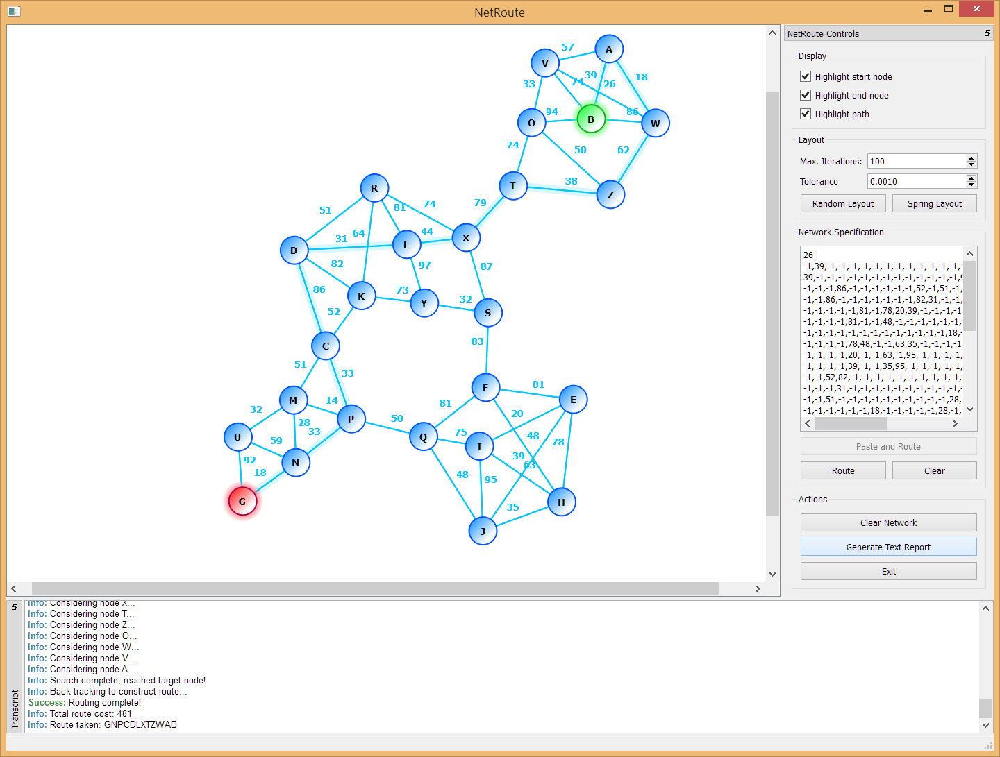

A Day in the Life of a Network Router
=====================================

A visual solution to [DailyProgrammer][dp_subreddit] challenge [#166bh][spec].



NetRoute is a Qt5 program that has been tested under both Linux and Windows
that will solve network problems for challenge #166bh using [Dijkstra's
algorithm][dijkstra].  [Boost.Graph][boost_graph] is used for the Kamada-Kawai
spring layout algorithm, and Qt's `QGraphicsScene` and `QGraphicsView` are used
to draw the graph itself.

[dp_subreddit]: http://www.reddit.com/r/dailyprogrammer/
[spec]:         http://www.reddit.com/r/dailyprogrammer/comments/287jxh/6152014_challenge_166b_hard_a_day_in_the_life_of/
[dijkstra]:     http://en.wikipedia.org/wiki/Dijkstra%27s_algorithm
[boost_graph]:  http://www.boost.org/libs/graph/doc/


Implementation Details
----------------------

This program has primarily been written as a learning exercise for making
custom objects in a `QGraphicsScene`, playing with some of the new C++11
features of Qt, and learning a bit about Boost.Graph.

Dijkstra's Algorithm is implemented (deliberately) using the graphical objects
directly rather that using the Boost.Graph objects.  No attempt has been made
to make the search itself optimal, aside from aborting the search early when
the target node has been found.  Boost.Graph iterators are also (deliberately)
not used within the implementation of Dijkstra's algorithm.

Possible future improvements include:

1.  Use a priority list to find the next nearest node; this may not be
    necessary as the largest problem size is fixed at 26 nodes as Z is the
    highest label that may be issued.
2.  Boost.Graph iterators and edges could be used instead of the graphical
    pointers and would provide a nice way of learning how to implement more
    complex algorithms using Boost.Graph.
3.  Boost.Graph's Dijkstra's algorithm could be used instead of a custom
    implementation to learn how to write Boost.Graph visitor objects.


Compiling
---------

The code has been tested on Windows 7/8, and Kubuntu 14.04.

### All platforms (probably)

Make sure that the Qt5 SDK and QtCreator are installed, then open the top
level `NetRoute.pro` in QtCreator and click run.

### Windows

1.  Install Visual Studio 2013
2.  Install the Qt5 SDK and the Qt VS2013 Addin
3.  Open `NetRoute.sln` and click run.

There's a weird issue in VS2013 where macros must specified in the
`*.vcxproj.user` file must appear before they're referenced.  After
`NetRoute.sln` is opened, you must specify a Qt target version to use (choose
Qt5.3 with OpenGL) and this will add `QTDIR` to your `NetRoute.vcxproj.user`
file.  The result is something like this:

```xml
<?xml version="1.0" encoding="utf-8"?>
<Project ToolsVersion="12.0" xmlns="http://schemas.microsoft.com/developer/msbuild/2003">
  <PropertyGroup Condition="'$(Configuration)|$(Platform)'=='Debug|Win32'">
    <LocalDebuggerEnvironment>PATH=$(QTDIR)\bin%3b$(PATH)</LocalDebuggerEnvironment>
    <DebuggerFlavor>WindowsLocalDebugger</DebuggerFlavor>
    <QTDIR>D:\SDKs\Qt\5.3\msvc2013_opengl</QTDIR>
  </PropertyGroup>
  <PropertyGroup Condition="'$(Configuration)|$(Platform)'=='Release|Win32'">
    <LocalDebuggerEnvironment>PATH=$(QTDIR)\bin%3b$(PATH)</LocalDebuggerEnvironment>
    <DebuggerFlavor>WindowsLocalDebugger</DebuggerFlavor>
    <QTDIR>D:\SDKs\Qt\5.3\msvc2013_opengl</QTDIR>
  </PropertyGroup>
</Project>
```

If clicking Run in VS2013 leads to an error that `Qt5Cored.dll` cannot be
found, follow these steps:

1.  Close the solution in VS2013
2.  Open `NetRoute.vcxproj.user` in a text editor
3.  Make sure the two `QTDIR` tags appear **before** `LocalDebuggerEnvironment`
4.  Save and re-open in VS2013

Now it should be able to find the Qt5 DLLs.
